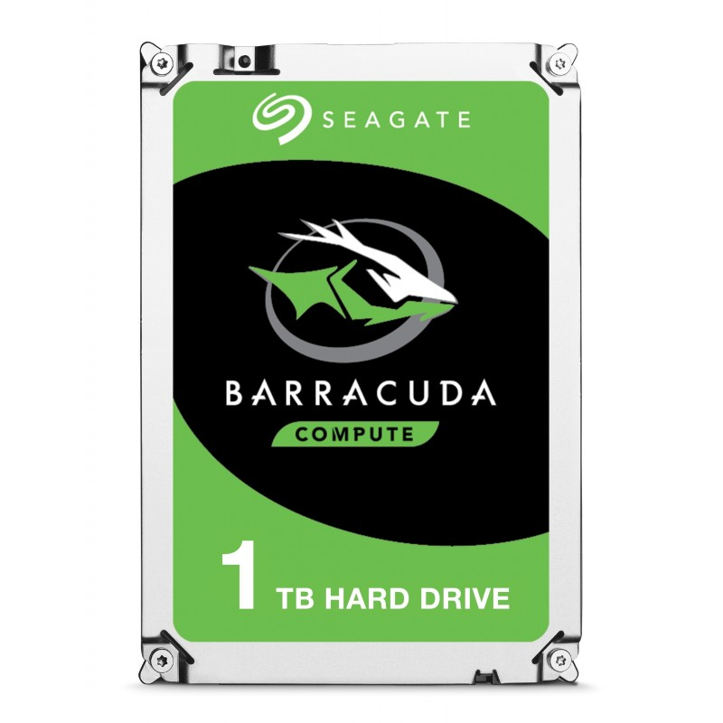
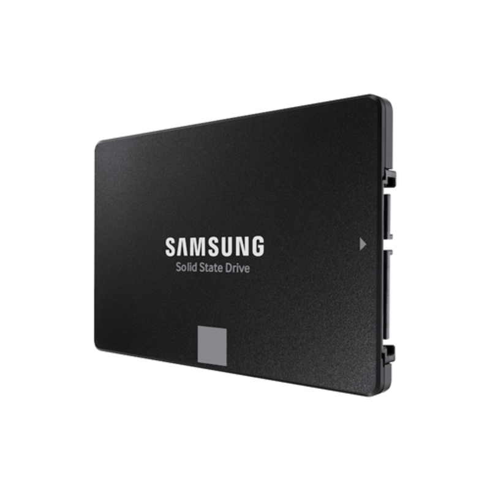
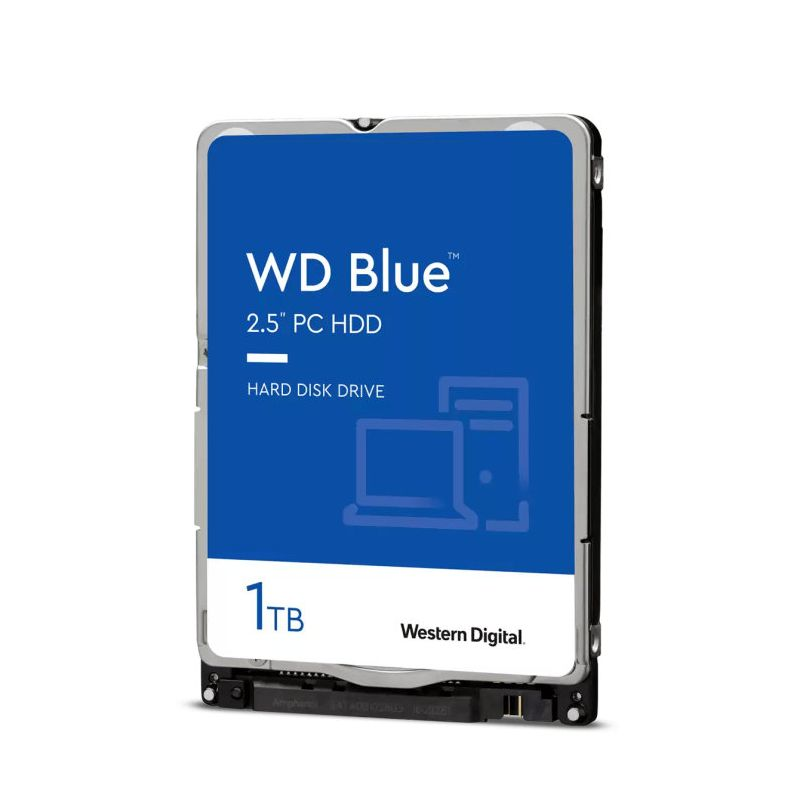
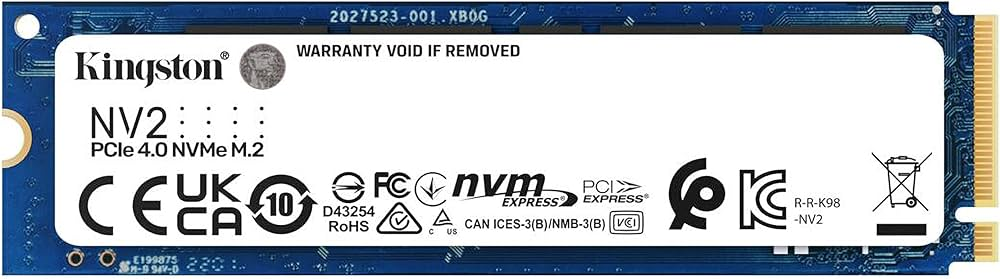

## Ejemplos comerciales  

| Modelo                | Tipo | Capacidad | Velocidad        | Interfaz |
|-----------------------|------|-----------|------------------|----------|
| Seagate Barracuda     | HDD  | 2 TB      | 7200 RPM        | SATA     |
| Western Digital Blue  | HDD  | 1 TB      | 5400 RPM        | SATA     |
| Samsung 870 EVO       | SSD  | 1 TB      | Hasta 560 MB/s  | SATA     |
| Kingston NV2         | SSD  | 2 TB      | Hasta 3500 MB/s | NVMe     |

